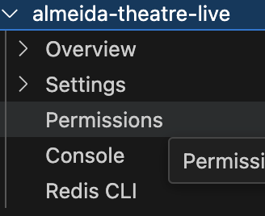
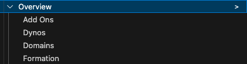
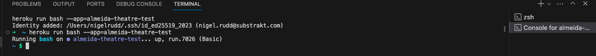

# Menu structure definition

The file structure.json contains the menu structure for the extension.  This breaks down the various elements to help understand how they work together.

## Top level
Currently this is team and defined as 

    "team": {
        "subMenus": [
            "app"
        ]
    }
The teams and apps are loaded at startup and built into a team/app structure for the menu (done in src/Heroku.ts methid loadBaseData).  This is the only level which doesn't follow the normal processing as the sub menuu items are already loaded in the method.

Once you get into the app menu

    "app": {
        "subMenus": [
            "overview",
            "settings",
            "accessList",
            "console",
            "resisCLI"
        ]
    },

the subMenus define what to include at the next layer, so this renders as

For overview there are a few more options

    "overview": {
        "label": "Overview",
        "subMenus": [
            "overviewAddon",
            "overviewDynos",
            "domains",
            "formation"
        ],
        "details": "/apps/{app_id}",
        "componentType": "Overview"
    },

- `label` is the menu item name
- `subMenus` are the levels below this
- `details` define how to fetch the more information about this item
- `componentType` is how to display this information.

As this has sub menus, the details are achieved by using the `>` to the right of the menu item...

Clicking on that will launch the componentType with the result from the deatils call.

For a standard menu item like Formation, this is achieved with 

    "formation": {
        "label": "Formation",
        "resource": "/apps/{app_id}/formation",
        "command": "heroku:openVueApp",
        "componentType": "Formation"
    },

This usess the `resource` element for the data to be passed to the `componentType` as opposed to the `details`.

For teriminal based menu items, the definition is along the lines of 

    "console": {
        "label": "Console",
        "command": "heroku:console",
        "consoleCommand": "heroku run bash --app={appName}"
    },

The `heroku:console` command is opens a terminal and will pass the `consoleCommand` to the terminal to run.

Should give something like

